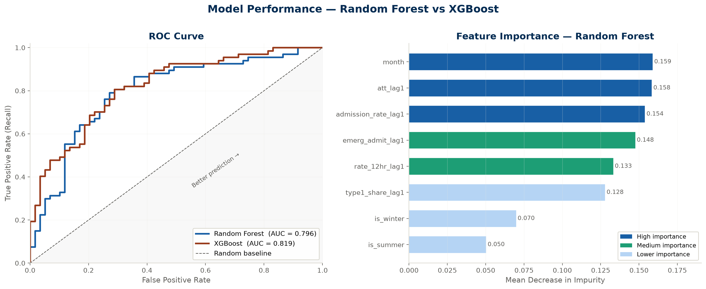

# NHS A&E Analytics - Breach Risk Prediction & Attendance Forecasting

> *Predicting which NHS providers are at risk of breaching the 4-hour A&E target - before it happens.*


---

## Why I built this

The NHS has a target that 95% of A&E patients should be seen, treated, and either admitted or discharged within 4 hours of arrival. That target hasn't been met nationally since **July 2015** - nearly a decade.

Individual trusts track their own four-hour performance in real time. What arrives late is the *national* picture: NHS England publishes on the second Thursday of the following month, so by the time providers can be compared against one another, the month you would have wanted to act on has already closed.

Using two years of NHS England open data, I built two models: a classifier that flags which providers are at risk of breaching next month, and a forecaster that projects how many patients are expected to arrive. Together they offer the one thing a cross-provider view currently doesn't have - **lead time**.

---

## Results at a glance

| | Breach Risk Predictor | Attendance Forecaster |
|---|---|---|
| Task | Binary classification | Time series forecasting |
| Model | **XGBoost** (vs Random Forest baseline) | **SARIMA** (0,0,0)(0,0,1)[12] |
| Headline metric | **ROC-AUC 0.819** | **MAPE 3.7%** |
| Test window | Jan – Mar 2026 | Jan – Mar 2026 |
| Explainability | SHAP values | Seasonal decomposition |

---

## The data

24 monthly CSV files from NHS England, April 2024 to March 2026, cleaned into **4,475 provider-month records across 203 providers**.

A note on terminology: the NHS England collection covers NHS trusts, foundation trusts *and* independent-sector organisations such as walk-in centres and community interest companies. A number of them are independent-sector organisations such as walk-in centres and community interest companies rather than NHS trusts. Monthly totals therefore run slightly below NHS England's published national figures and should not be read as national totals.

Against the official 95% standard, the breach rate across the whole dataset is **68.9%** - which is precisely why the modelling uses a different threshold (see design decisions below).

**How the 24 months are used by the classifier:**

| Months | Use |
|---|---|
| Apr 2024 | Consumed by lag features — no prior month to draw from |
| May 2024 - Dec 2025 | Training - 834 rows |
| Jan 2026 - Mar 2026 | Test - 126 rows |

The split is strictly temporal. The model is never shown a future month during training, which is the only honest way to evaluate a forecasting-style problem. The provider-selection step below is also computed on the training period alone, so no test-window outcome influences which providers enter the study.

---

## Project 1 - A&E Breach Risk Predictor

**Question:** *Will this provider fall below the 75% performance threshold next month?*

### Features

8 features across two groups:

- **Seasonality flags** - `is_winter` (Dec/Jan/Feb), `is_summer` (Jun/Jul/Aug), calendar month
- **One-month lags** - previous month's attendances, admission rate, 12-hour wait rate, type-1 share and emergency admissions, computed per provider

Current-month operational metrics are deliberately excluded. They arrive in the same NHS publication as the target, so a model using them would be describing a month that had already closed rather than forecasting one still open. Every feature is either known in advance (the calendar) or lagged by a month.

### Model comparison

| Metric | Random Forest | XGBoost *(selected)* |
|---|---|---|
| ROC-AUC | 0.796 | **0.819** |
| Accuracy | 0.68 | **0.72** |
| Precision (breach) | 0.64 | **0.67** |
| Recall (breach) | 0.93 | **0.93** |
| F1 (breach) | 0.76 | **0.78** |

The two models sit close enough that the gap is inside the noise of a 126-row test set. XGBoost is reported as selected; SHAP attribution is computed on the Random Forest.

### Confusion matrix - XGBoost, 126 test rows

| | Predicted no breach | Predicted breach |
|---|---|---|
| **Actual no breach** | 29 | 30 |
| **Actual breach** | 5 | 62 |

The model catches 62 of 67 actual breaches and misses 5, at the cost of 30 false alarms. That trade-off is deliberate, in an early-warning context, investigating a provider that turns out fine costs a meeting, while missing a deteriorating provider costs patient waiting time.

---

## Project 2 - A&E Attendance Forecaster

**Question:** *How many patients are coming next month?*

| | Detail |
|---|---|
| Selected order | SARIMA (0,0,0)(0,0,1)[12] with intercept |
| Selection method | Stepwise AIC search via `pmdarima` - AIC 538.12 |
| Stationarity | ADF statistic −5.04, p < 0.001 - stationary, no differencing required |
| Training | 21 months, Apr 2024 – Dec 2025 |
| Test | 3 months, Jan 2026 – Mar 2026 |
| MAE | 80,320 patients |
| RMSE | 83,873 patients |
| MAPE | **3.7%** |

An average error of ~80,000 patients sounds large until you set it against a monthly baseline of roughly 2.2 million attendances across the 203 providers in this dataset.

Worth reading the selected order carefully: no autoregressive terms, no differencing, one seasonal MA term. That is a constant with a damped seasonal adjustment, not a structural model of demand, which is the honest conclusion to draw from 21 observations against a 12-month cycle.

---

## What the data revealed

- **The 95% target no longer discriminates between providers.** Nearly seven in ten provider-months breach it. The useful operational question is no longer "will they breach?" but "how badly, and who next?"

- **Seasonality dominates everything operational.** The three calendar features together carry roughly five times the mean SHAP weight of the strongest operational metric. The single best predictor of next month's breach risk is what time of year it is. The winter signal was supplied to the model as an engineered flag; what the model learned is how strongly it predicts breaches.

- **No single operational metric stands out.** Previous-month 12-hour waits (0.036), admission rate (0.035) and attendance volume (0.031) land within 0.005 of each other on mean SHAP. 12-hour waits edge ahead in most runs but not all, across ten random seeds the ordering flipped twice. With 24 months of data these should be treated as comparable rather than ranked.

- **Attendance is strongly seasonal, with no reliable trend over 24 months.** February dips in both years (2.01M in 2025, 2.04M in 2026); March peaks (2.30M, 2.35M). Notably, automated order selection settled on a seasonal-MA model around a constant mean rather than a trending one. with 21 training observations there simply isn't evidence to claim a structural rise in demand.

---

## Key charts

### NHS A&E performance over time


### Model comparison - ROC curves


### SHAP feature importance - what drives breach risk


### Time series decomposition - trend, seasonality, residual


### SARIMA attendance forecast - Jan to Mar 2026


---

## Design decisions

These choices came out of the data rather than being assumed at the start, and they're the ones worth questioning.

**Why a 75% breach threshold, not the official 95%?**
At 95%, the overwhelming majority of provider-months are breaches. There is almost nothing to predict, and a classifier would simply memorise provider identity. A 75% threshold is still clinically meaningful (one in four patients waiting over four hours) and produces genuine month-to-month variation. At this threshold the overall breach rate is 46.6%, a workable class balance. It also sits close to the 78% interim minimum standard NHS England set for March 2026 in the Urgent and Emergency Care Plan, though see the limitations below on how that should and shouldn't be read.

**Why filter to 45 providers?**
After setting the 75% threshold, I checked provider-level consistency across the training period. Of the 200 providers present in the training period, 66 breach in more than 90% of months and 89 in fewer than 10%, leaving 45 where the outcome is genuinely uncertain. Training on the consistently-failing and consistently-passing providers would inflate AUC by letting the classifier memorise provider identity rather than learn conditions. Restricting to the 45 uncertain providers gives 0.819.

The filter is computed on training-period outcomes only. Computing it across all 24 months would let the January–March 2026 results influence which providers enter the study, which is a subtle form of selection on the target.

**Why exclude current-month features?**
The target and the current-month operational metrics arrive in the same NHS publication on the same day. A model using December's attendances to predict December's breach could not be run until December's answer was already public. Restricting to calendar features and one-month lags costs very little in performance, and it is what makes the month-ahead framing honest.
**Why a one-month lag rather than a longer window?**
Lag features cost you data at the start of the series: with `shift(1)`, April 2024 has no prior month and is dropped. A three-month window would discard three months instead of one. A longer window captures whether a provider is *deteriorating over time* rather than having one bad month, so there's a real trade-off between trend signal and training volume. On this dataset the one-month lag scored higher, but with a longer series the answer could reverse.

**Why SARIMA rather than an LSTM?**
With only 24 monthly data points, deep learning models would massively overfit. SARIMA is specifically designed for short seasonal time series. It's the right tool for this data, not a fallback.

**Why optimise for recall over precision?**
See the confusion matrix above, the asymmetry between a missed breach and a false alarm is real, and the threshold reflects it.

---

## Limitations

Stated openly, because they'd come up in any serious review:

- **24 months is a short series.** The forecaster trains on 21 observations, which limits how much seasonal structure can be estimated and rules out trend claims. Extending the series back to 2022 is the highest-value next step.
- **The 75% threshold is a modelling choice.** It was selected for statistical tractability, though it sits close to the 78% interim minimum standard NHS England set for March 2026. It is not itself an NHS standard and should not be read as a clinical target.
- **Filtering to 45 providers narrows generalisability.** The classifier is calibrated for providers near the decision boundary; it says nothing useful about consistently strong or consistently failing providers.
- **A single 3-month test window.** 126 evaluation rows, no walk-forward cross-validation across multiple temporal folds, so the reported AUC carries meaningful variance and should not be read to three decimal places.
- **Correlated seasonal features.** `month`, `is_winter` and `is_summer` encode overlapping signal, so SHAP splits credit among them and the true seasonal weight is their sum rather than any one bar. `month` is also numerically encoded, placing December and January at opposite ends of the scale despite being adjacent seasons. cyclical encoding is a planned improvement.
- **Provider coverage.** The 203 providers include walk-in centres and community interest companies alongside NHS trusts. Monthly totals run below NHS England's published national figures and should not be read as national totals.
- **Correlation, not causation.** SHAP shows what the model relies on, not what would happen if a provider intervened on those variables.

---

## Project structure

```
nhs-ae-analytics/
│
├── code-files/
│   ├── Data cleaning.ipynb                # Load, clean and save 24 months of NHS data
│   ├── EDA.ipynb                          # 5 exploratory charts
│   ├── feature engineering model.ipynb    # ML pipeline - RF, XGBoost, SHAP (project 1)
│   └── attendance forecasting.ipynb       # SARIMA time series model (project 2)
│
├── data/
│   ├── raw/                               # 24 original NHS England CSV files
│   └── cleaned/
│       ├── ae_clean.csv                   # Cleaned dataset - 4,475 rows, 203 providers
│       └── model_predictions.csv          # Provider-level breach predictions, Jan-Mar 2026
│
├── output-files/                          # 12 generated charts (01-12)
│
└── README.md
```

---

## Tech stack

| Category | Tools |
|---|---|
| Language | Python 3.12 |
| Data processing | pandas, numpy |
| Machine learning | scikit-learn, xgboost |
| Explainability | shap |
| Time series | statsmodels, pmdarima |
| Visualisation | matplotlib, seaborn |
| Data source | NHS England open data (public) |

Class imbalance is handled inside the estimators - `class_weight='balanced'` for the Random Forest and `scale_pos_weight` for XGBoost - rather than by resampling.

---

## How to run this

**1. Clone the repo**
```bash
git clone https://github.com/abhiig0802/nhs-ae-analytics.git
cd nhs-ae-analytics
```

**2. Install dependencies**
```bash
pip install pandas numpy matplotlib seaborn scikit-learn xgboost shap statsmodels pmdarima openpyxl
```

**3. Run the notebooks in order**
```
1. Data cleaning.ipynb              → produces ae_clean.csv
2. EDA.ipynb                        → produces charts 01-05
3. feature engineering model.ipynb  → produces charts 06-09 + model_predictions.csv
4. attendance forecasting.ipynb     → produces charts 10-12
```

All paths are relative and both models are seeded (`random_state=42`), so results reproduce exactly on any machine.

---

## Data source

All data is from **NHS England's open data portal** - publicly available, no registration required.

- [A&E Attendances and Emergency Admissions 2024-25](https://www.england.nhs.uk/statistics/statistical-work-areas/ae-waiting-times-and-activity/ae-attendances-and-emergency-admissions-2024-25/)
- [A&E Attendances and Emergency Admissions 2025-26](https://www.england.nhs.uk/statistics/statistical-work-areas/ae-waiting-times-and-activity/ae-attendances-and-emergency-admissions-2025-26/)

24 monthly CSV files covering April 2024 to March 2026.

---

## About

Built by **Abhiram Gadikota** - MSc Data Science, Cardiff University.
Dissertation: machine learning for financial market volatility forecasting.
Currently looking for data analyst and data science roles in Cardiff and across the UK.

Open to opportunities - feel free to reach out via GitHub.

---

*Data is open source. Code is original. Every figure in this README is reproducible from the notebooks in this repo.*