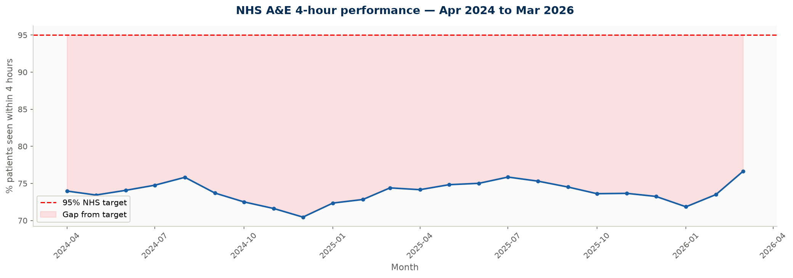
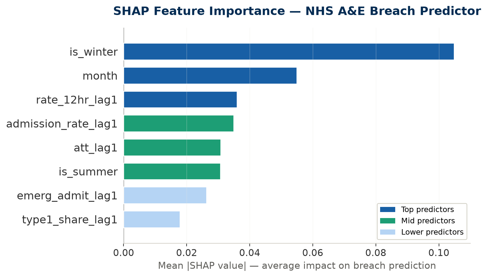
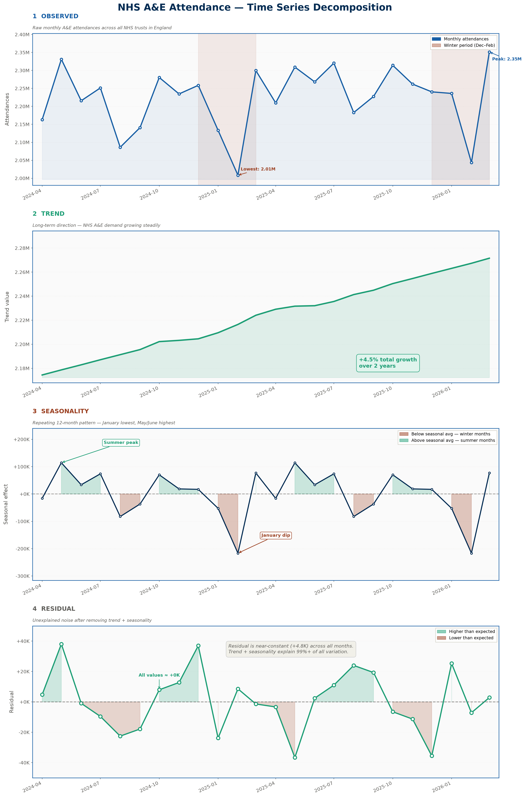
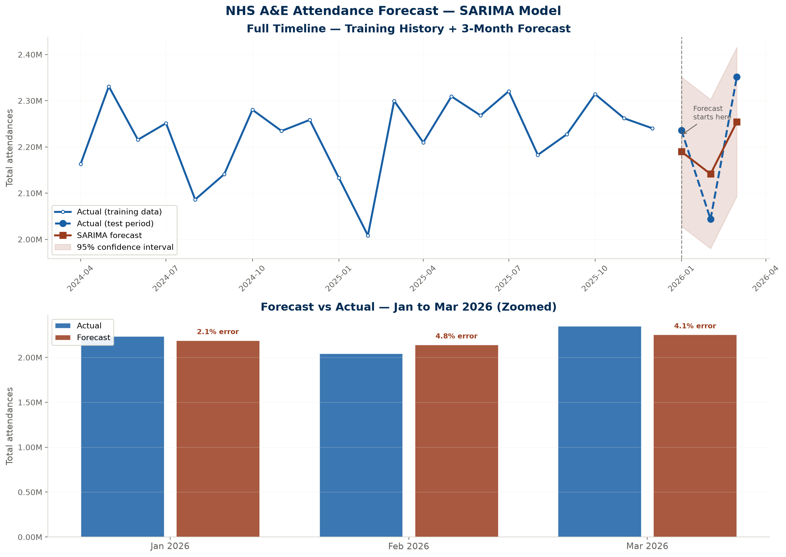

#  NHS A&E Analytics - Breach Risk Prediction & Attendance Forecasting

> *Predicting which NHS trusts are at risk of breaching the 4-hour A&E target - before it happens.*


---

##  Why I built this

The NHS has a target that 95% of A&E patients should be seen, treated, and either admitted or discharged within 4 hours of arrival. That target hasn't been met nationally since **July 2015**, nearly a decade.

The problem isn't that NHS managers don't care. It's that they only find out a trust has failed the target *after* the month ends, when it's too late to do anything about it. No early warning. No time to act.

I built this project to change that. Using two years of real NHS England open data, I trained a machine learning model that predicts in advance, which trusts are at risk of breaching in the coming month, and a forecasting model that projects exactly how many patients are expected to arrive. Together they give operations managers the one thing they currently don't have: **time to respond**.

---

##  The two projects

### Project 1 - A&E Breach Risk Predictor
**Question answered:** *Will this trust fall below the 75% performance threshold next month?*

- Binary classification using Random Forest and XGBoost
- Trained on 21 months, tested on Jan–Mar 2026 (temporal holdout)
- SHAP explainability - the model explains *why* it flagged a trust
- **ROC-AUC: 0.77** on genuinely uncertain trusts

### Project 2 - A&E Attendance Forecaster  
**Question answered:** *How many patients are coming next month?*

- SARIMA time series model with seasonal decomposition
- Forecasts national monthly attendance 3 months ahead
- Confidence intervals show the range of uncertainty
- **MAPE: 3.7%** - only 80,320 patients off on average across 2.2 million monthly attendances

---

##  What the data revealed

These findings came out of the EDA and modelling - none of them were assumed going in:

- **The 95% target is effectively dead for major hospitals.** 128 out of 203 NHS trusts breach it every single month without exception. The real operational question is no longer "will they breach 95%?" but "how badly?"

- **Winter is the single biggest driver of breach risk.** December, January and February push breach probability significantly higher, confirmed by both the SHAP analysis and the seasonal decomposition chart. The model didn't need to be told this; it learned it from the data.

- **It's not just how many patients arrive - it's how many get admitted.** Admission rate ranked third in SHAP importance, above raw attendance volume. When wards are full and patients can't move out of A&E, the department backs up. This is the bed-blocking signal.

- **12-hour waits are a leading indicator.** Trusts already showing high 12-hour wait rates are significantly more likely to breach the following month. This is potentially the most actionable finding - monitor 12-hour waits as an early warning.

- **NHS A&E demand is growing steadily.** The trend component of the decomposition shows consistent month-on-month growth across 2024–2026. This isn't noise, it's a structural increase in demand.

---

##  Project structure

```
nhs-ae-analytics/
│
├── code-files/
│   ├── Data cleaning.ipynb          # Load, clean and save 24 months of NHS data 
│   ├── EDA.ipynb                    # 5 exploratory charts - performance, seasonality, regions
│   ├── feature engineering model.ipynb   # ML pipeline - RF, XGBoost, SHAP (project 1)
│   └── attendance forecasting.ipynb      # SARIMA time series model (project 2)
│
├── data/
│   ├── raw/                         # 24 original NHS England CSV files
│   └── cleaned/
│       ├── ae_clean.csv             # Cleaned dataset - 4,475 rows, 203 trusts
│       └── model_predictions.csv   # Trust-level breach predictions Jan-Mar 2026
│
├── output-files/
│   ├── 01_monthly_performance.png
│   ├── 02_performance_distribution.png
│   ├── 03_worst_trusts.png
│   ├── 04_seasonal_pattern.png
│   ├── 05_regional_performance.png
│   ├── 06_model_comparison.png
│   ├── 07_confusion_matrix.png
│   ├── 08_shap_importance.png
│   ├── 09_shap_beeswarm.png
│   ├── 10_national_attendance_trend.png
│   ├── 11_time_series_decomposition.png
│   └── 12_sarima_forecast.png
│
└── README.md
```

---

##  Key charts

### NHS A&E performance over time


### SHAP feature importance — what drives breach risk


### Time series decomposition — trend, seasonality, residual


### SARIMA attendance forecast — Jan to Mar 2026


---

##  Model results 

| | Project 1 - Breach Predictor | Project 2 - Attendance Forecaster |
|---|---|---|
| Model | Random Forest | SARIMA |
| Metric | ROC-AUC: **0.770** | MAPE: **3.7%** |
| Comparison model | XGBoost (AUC: 0.751) | — |
| Training period | Jul 2024 – Dec 2025 | Apr 2024 – Dec 2025 |
| Test period | Jan 2026 – Mar 2026 | Jan 2026 – Mar 2026 |
| Missed breaches | 7 false negatives | — |
| Explainability | SHAP values | Seasonal decomposition |

---

##  Tech stack

| Category | Tools |
|---|---|
| Language | Python 3.12 |
| Data processing | pandas, numpy |
| Machine learning | scikit-learn, xgboost, imbalanced-learn |
| Explainability | shap |
| Time series | statsmodels, pmdarima |
| Visualisation | matplotlib, seaborn |
| Data source | NHS England open data (public) |

---

##  How to run this

**1. Clone the repo**
```bash
git clone https://github.com/abhiig0802/nhs-ae-analytics.git
cd nhs-ae-analytics
```

**2. Install dependencies**
```bash
pip install pandas numpy matplotlib seaborn scikit-learn xgboost imbalanced-learn shap statsmodels pmdarima openpyxl
```

**3. Run the notebooks in order**
```
1. Data cleaning.ipynb       → produces ae_clean.csv
2. EDA.ipynb                 → produces charts 01–05
3. feature engineering model.ipynb  → produces charts 06–09 + predictions
4. attendance forecasting.ipynb     → produces charts 10–12
```

All file paths are relative — no changes needed to run on any machine.

---

##  Data source

All data is from **NHS England's open data portal** - publicly available, no registration required.

- [A&E Attendances and Emergency Admissions 2024-25](https://www.england.nhs.uk/statistics/statistical-work-areas/ae-waiting-times-and-activity/ae-attendances-and-emergency-admissions-2024-25/)
- [A&E Attendances and Emergency Admissions 2025-26](https://www.england.nhs.uk/statistics/statistical-work-areas/ae-waiting-times-and-activity/ae-attendances-and-emergency-admissions-2025-26/)

24 monthly CSV files covering April 2024 to March 2026.

---

##  A note on model design decisions

A few choices in this project are worth explaining because they came from the data, not assumptions:

**Why 75% as the breach threshold, not 95%?**  
The official NHS target is 95%. But when I ran the analysis, 128 out of 203 trusts breach it every single month. there's nothing to predict. The model would just memorise trust identities. 75% is clinically meaningful (1 in 4 patients waiting over 4 hours) and creates genuine month-to-month variation the model can actually learn from.

**Why filter to 48 trusts for the model?**  
After setting the 75% threshold, I checked trust-level consistency. 50 trusts breach every month, 83 never breach,leaving 48 genuinely uncertain trusts where prediction has value. Training on always-breaching and never-breaching trusts inflates the AUC artificially. The honest 0.77 from 48 uncertain trusts is worth more than a dishonest 0.99 from all 203.

**Why SARIMA for forecasting and not LSTM?**  
With only 24 monthly data points, deep learning models would massively overfit. SARIMA is specifically designed for short seasonal time series. It's the right tool for this data, not a fallback.

---

##  About

Built by **ABHIRAM GADIKOTA** — MSc Data Science, Cardiff University.  
Dissertation: machine learning for financial market volatility forecasting.  
Currently looking for data analyst and data science roles in Cardiff and across the UK.

 Open to opportunities - feel free to reach out via GitHub.

---

*Data is open source. Code is original. Findings are real.*
